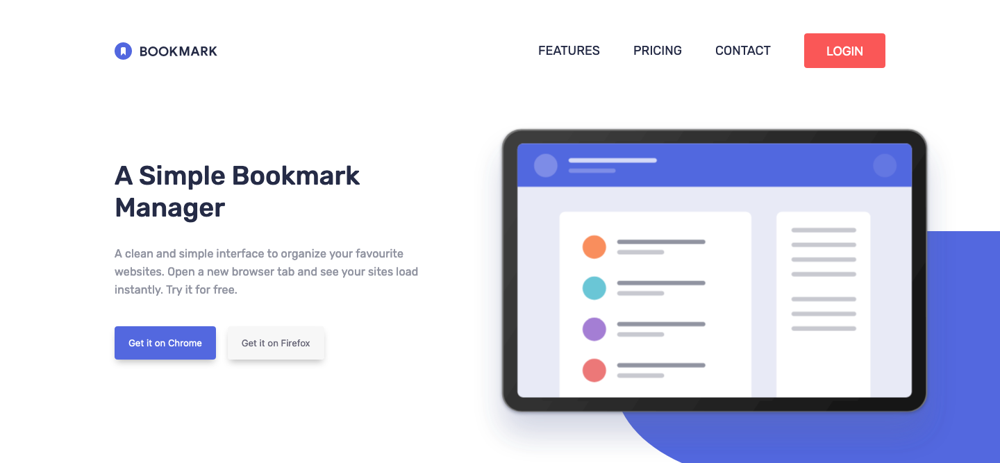

# Frontend Mentor - Bookmark landing page solution

This is a solution to the [Bookmark landing page challenge on Frontend Mentor](https://www.frontendmentor.io/challenges/bookmark-landing-page-5d0b588a9edda32581d29158). Frontend Mentor challenges help you improve your coding skills by building realistic projects. 

## Table of contents

- [Overview](#overview)
  - [The challenge](#the-challenge)
  - [Screenshot](#screenshot)
  - [Links](#links)
- [My process](#my-process)
  - [Built with](#built-with)
  - [What I learned](#what-i-learned)
  - [Useful resources](#useful-resources)
- [Author](#author)


## Overview

### The challenge

Users should be able to:

- View the optimal layout for the site depending on their device's screen size
- See hover states for all interactive elements on the page
- Receive an error message when the newsletter form is submitted if:
  - The input field is empty
  - The email address is not formatted correctly

### Screenshot




### Links

- Solution URL: [https://www.frontendmentor.io/solutions/bookmark-landing-page-using-flexbox-6ERWrdYiV](https://www.frontendmentor.io/solutions/bookmark-landing-page-using-flexbox-6ERWrdYiV)
- Live Site URL: [https://bookmark-landing-page-zeta-liart.vercel.app/](https://bookmark-landing-page-zeta-liart.vercel.app/)

## My process

### Built with

- Semantic HTML5 markup
- CSS custom properties
- Flexbox
- Mobile-first workflow
- SASS preprocessor
- BEM methodology


### What I learned

With this challenge, I learned to manipulate SVGs in order to change their color with the `fill` and `stroke`CSS properties.

```css
.logo {
    path {
        transition: .25s ease-in-out;
    }
    circle {
        transition: .25s ease-in-out;
    }
    &--all-white {
        path {
            fill: #ffffff;
            &:last-child {
                fill: $very-dark-blue-transparent;
            }
        }
        circle {
            fill: #ffffff;
        }
    }
    &--white-wording {
        path {
            fill: #ffffff;
        }
    }
}
```


### Useful resources

- [Accessible SVGs](https://css-tricks.com/accessible-svgs/) - Nice explanation on how to make inline SVGs accessible.
- [Menu "Hamburger" Icon Animations](https://codepen.io/designcouch/pen/Atyop) - Some examples of animated burger menu icon.

## Author

- Website - [Thibault Barrat](https://www.thibault-barrat.com/)
- Frontend Mentor - [@thibault-barrat](https://www.frontendmentor.io/profile/thibault-barrat)
- Twitter - [@Thib_Bar](https://www.twitter.com/Thib_Bar)

